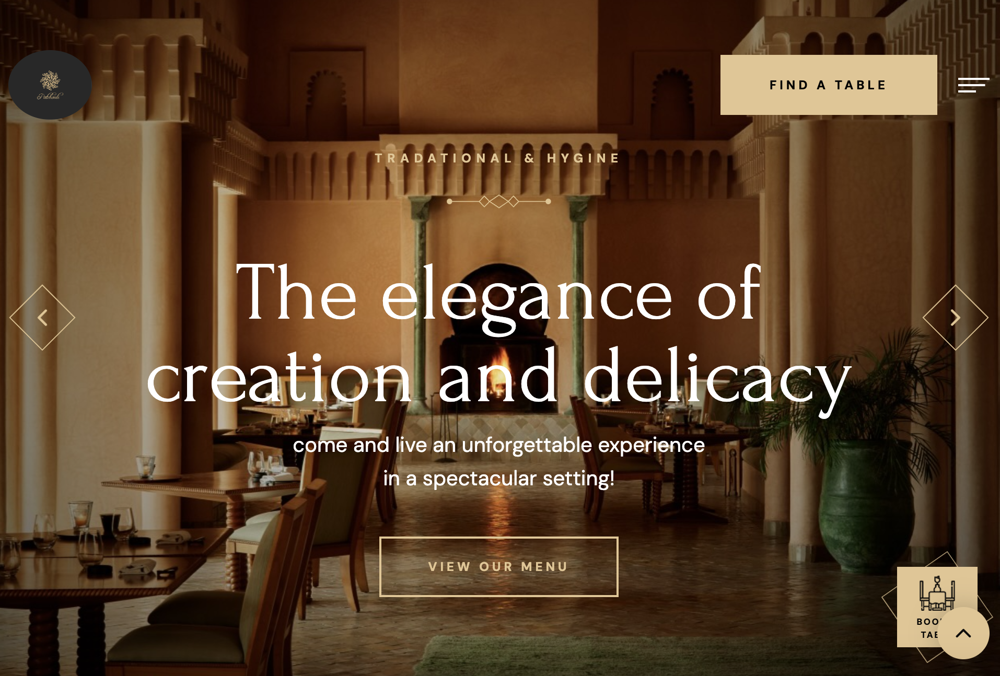
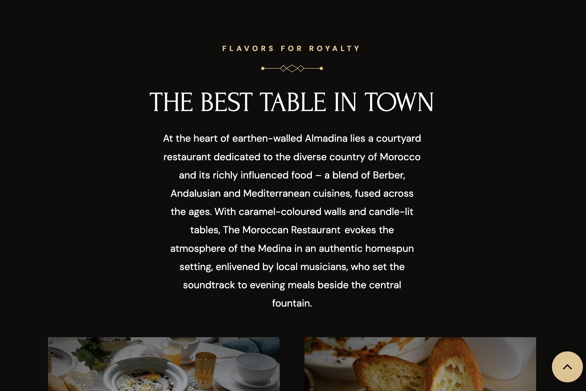
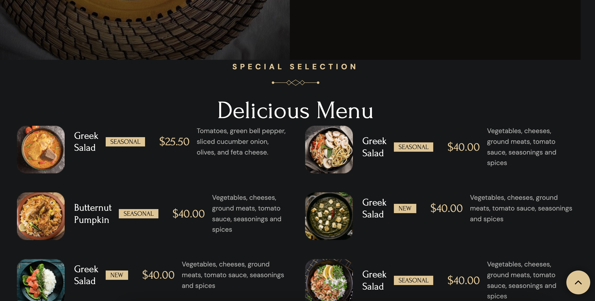
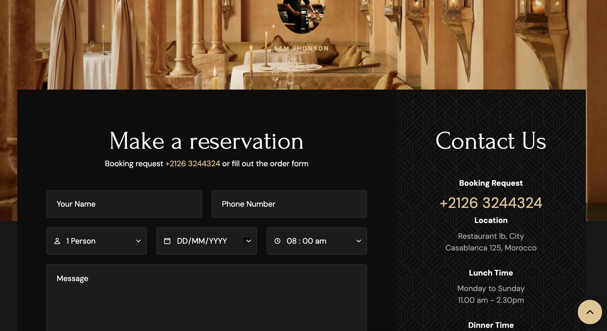
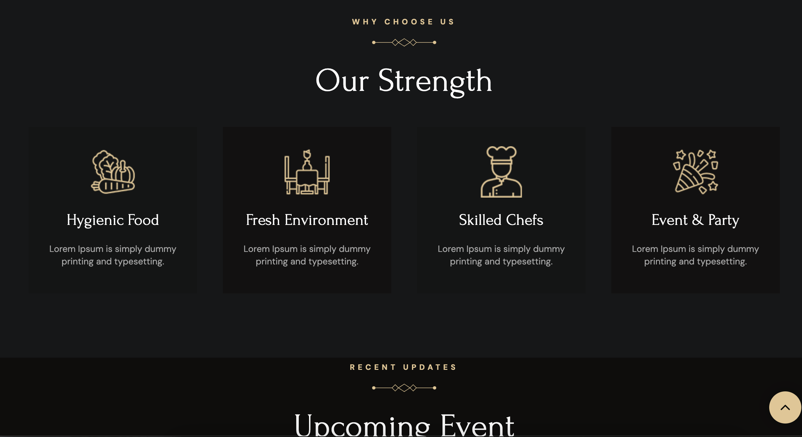
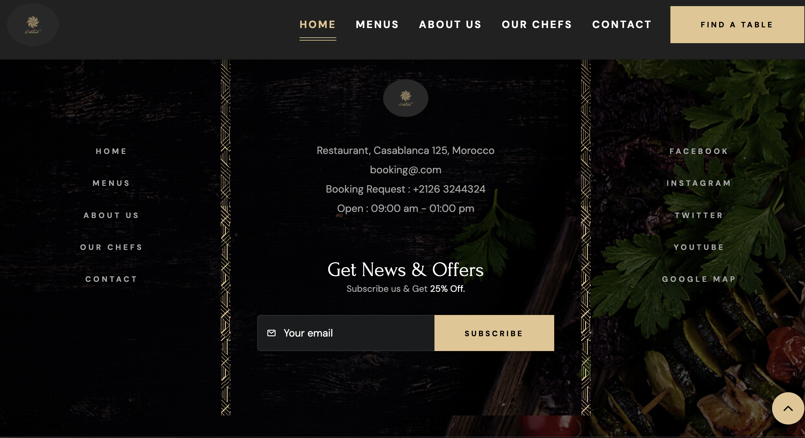

# 🌟 Moroccan Restaurant Website 🌟

Welcome to the **Moroccan Restaurant** website! 🇲🇦 This site brings the authentic taste and atmosphere of Morocco to life.
## 🍴 About the Project:
This project showcases a stunning website for a Moroccan restaurant located at the heart of **Almadina**. The website is designed to evoke the cozy.

### 🏠 Features:
- **Responsive Layout**: The website is optimized for both mobile and desktop devices. 📱💻
- **Stunning Images**: High-quality, mouth-watering images of Moroccan dishes and the restaurant’s ambiance. 🍲📸
- **Menu Section**: Guests can explore different breakfast and dining options. 🥘🍞
- **Cultural Touches**: The design reflects Moroccan culture with its colors, music, and food descriptions. 🎶🎨

## 🚀 Technologies Used:
- **HTML**: Structure of the website 🏗️
- **CSS (SCSS)**: Styling the website to make it look elegant and Moroccan-inspired 🌸
- **JavaScript**: For any interactive elements 🖥️
- **Images**: Beautiful, high-quality images to showcase the atmosphere 📸

## 🧑‍🍳 Features You Can Explore:
- **Breakfast Menu** 🍽️
- **Diverse Moroccan Dishes** 🥘
- **Atmospheric Design** 🎶
- **Authentic Dining Experience** 🕯️

## 🎥 Screenshots:
Below is a sample view of how the restaurant’s website is shown to visitors :

## 📬 Contact:
If you have any questions or suggestions, feel free to reach out to me via email or open an issue here on GitHub!
